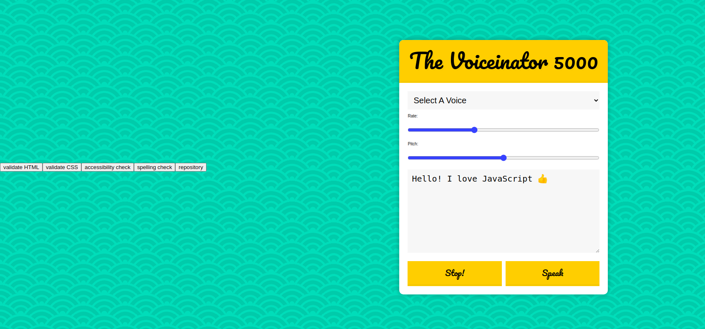

# Speech-Synthesis

> A simple web site allows the user to enter something and then the input will convert to voice , it allows the user to select different accents , change the voice speed rate and the pitch (highness or lowness of the voice).

## Table of contents
* [General info](#general-info)
* [Screenshots](#screenshots)
* [Technologies](#technologies)
* [Setup](#setup)
* [Features](#features)
* [Status](#status)
* [Inspiration](#inspiration)
* [Contact](#contact)

## General info

The web site is created by `Wes Bos`, his code is written in a single `HTML` file. The main goal is learning how to separate the code into different files, in the repository the single `HTML` file has been divided in to `HTML`,`CSS` and five `JS` files.

## Screenshots


## Technologies
* JavaScript
* HTML
* CSS
* VSC code


## Setup
open index.html in your browser and type what ever you want and enjoy listing to what you typed

## Code Examples

```js

```


## Features
List of features ready and TODOs for future development

* 
* 
* 

To-do list:

* 
* 

## Status
Project is: _in progress_

## Inspiration
The project is created by `Wes Bos`

## Contact
Refracted  by [@samirm00] 
