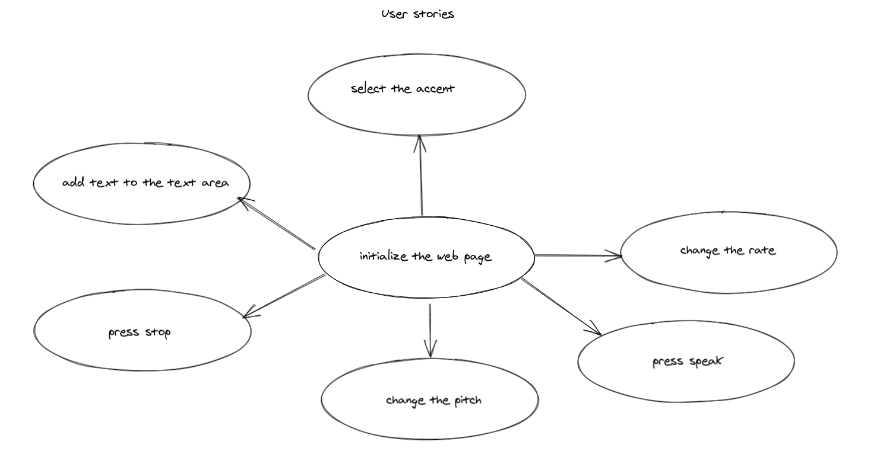

# CSS variables 

A simple web site allows the user to change the border width of an image in the web site , it also allows the user to change the blurriness , the color of the border and some text on the page title. 

---

## User Story Dependencies

---

## WIREFRAME

[figma](https://www.figma.com/file/owY0cg1h7wvCDMOsYIEtBE/CSS-Variables?node-id=2%3A2)

---

## 0.Setup

- fork the `javaScript-30-starter` template 
- use the template to create a new repo `jCSS-VAriables`
- create a project board `CSS-Variables-project-board`
- create milestones and issues.
---

## X. Initialize the web page 

> how much work do you think this step will take?  medium

***As user I want to open `CSS-Variables` web site to know more about variables in `CSS`.**

- When I open the web site `CSS-Variables` , I see a picture with brown bold border , the title of the page `Update CSS Variables with JS`and `JS` has the same color as the picture border
...

### REPO

- This user story is developed on branch `1-initialize`.
- This branch is merged to `master` branch after the acceptance criteria have been checked off.

### Concern A

- `html`: create DOM elements `h2`,`div` parent , 3 `label` and 3 `input` as children 

### Concern B

- `main.css`: add style to the page `background`,`font size & family` , margin to `div` parent and `width` to `input`.

## X. Spacing 

> how much work do you think this step will take?  medium

**As user I want to scroll the button beside `Spacing` to see what it does.** 

- When I scroll the button , I see the picture border with increasing. 

- I can modify the picture border with when i scroll to th right and to the left using my mouse. 
...

### REPO

- This user story is developed on branch `2-spacing`.
- This branch is merged to `master` branch after the acceptance criteria have been checked off.

### Concern A

- `main.css`: create root element and add spacing variable`spacing` to the `root` element and to `img`

### Concern B

- `handleUpdate.js`  add `handleUpdate()` function to change the value of the `spacing` when `change` or `mouseMovement` happened. 

### Concern C

- `inputChange.js` file to add event which will call the function `handleUpdate()` when `change` happened 

### Concern D

- `inputChange.js` file to add event which will call the function `handleUpdate()` when `mouseMove`happened 

## X. Blur

> how much work do you think this step will take?  medium

**As user I want to scroll the button beside blur to see what it does.** 

As user I want to scroll the button beside `Blur` to see what it does. 

- When I scroll the button , I see the picture blur increases .

- I can modify the picture blur with when i scroll to th right and to the left using my mouse. 
 
...

### REPO

- This user story is developed on branch `3-blur`.
- This branch is merged to `master` branch after the acceptance criteria have been checked off.

### Concern A

- `main.css`: create root element and add spacing variable`blur` to the `root` element and to `img`

## X. Base Color

> how much work do you think this step will take?  medium

**As user I want click on the rectangle beside `Base Color` , I want to know what it does.** 

- When I click on the rectangle a color picker pumped up  up and i can choose the color I want  .

- When I choose the color and click out side of the color picker , the border of the color and the word 'JS' change to the color I picked. 

...

### REPO

- This user story is developed on branch `4-base`.
- This branch is merged to `master` branch after the acceptance criteria have been checked off.

### Concern A

- `main.css`: create root element and add spacing variable`base` to the `root` element , to `img` and `h1` element.
